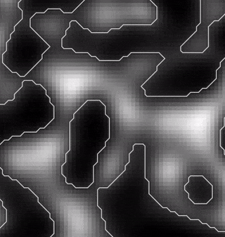
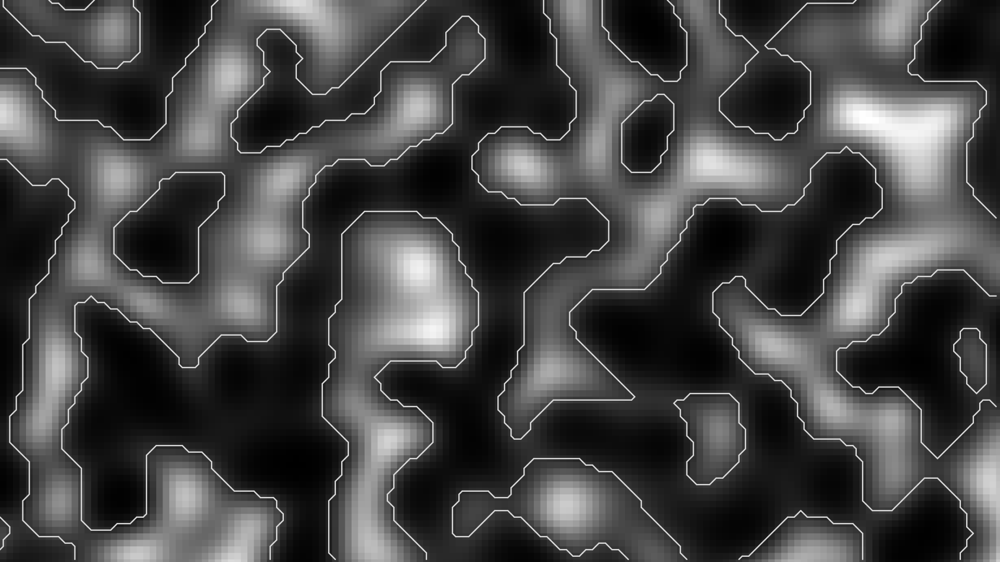
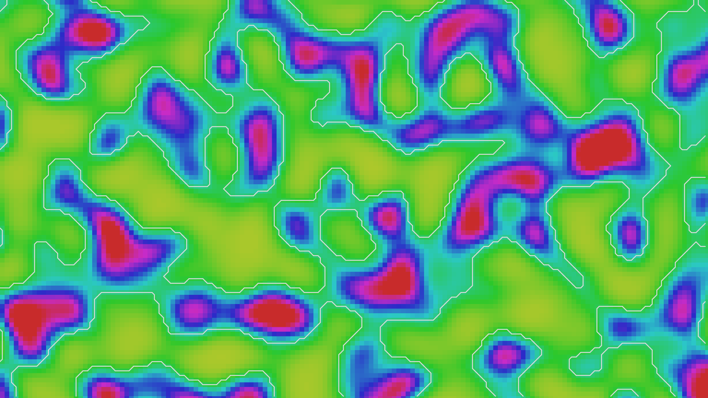
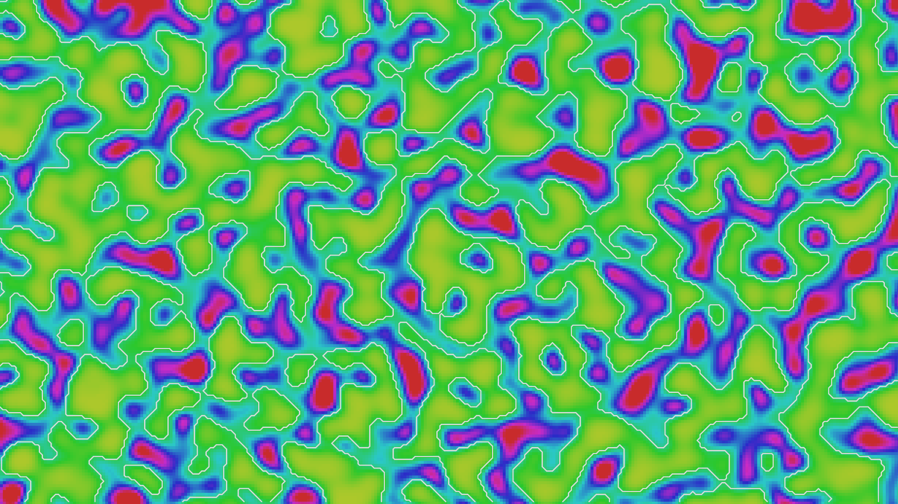

# Procedural Cave Generation by Marching Squares

Inspired by [@daniel shiffman](https://github.com/CodingTrain)
It's so satisfying to see it, isn't it?😍

Go and visit this [link](https://amishranpariya.github.io/procedural_cave/) to see it live.🎉🥳

Here are some caves generated by This method.

> Happy coding🥰
